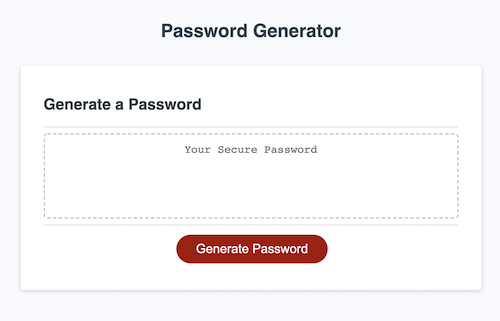
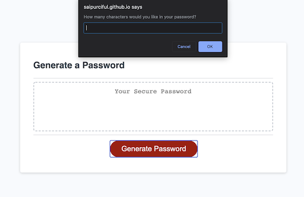
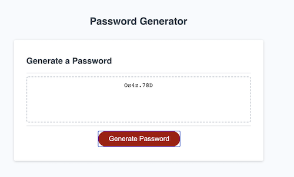

# Password-Generator

<h2>What is Password Generator?</h2>

A random password generator is a tool that automatically generates a password based on guidelines that user sets to create a strong and unpredictable passwords for each of their account, including mixed-case letters (uppercase and lowercase), numbers and symbols. 

<h2>About The Project</h2>

The project is to creating an application that generates a random password based on user-selected criteria. This app runs in the browser and feature dynamically updated HTML and CSS powered by JavaScript code. It will also feature a clean and polished user interface and be responsive, ensuring that it adapts to multiple screen sizes.

<h2>What's Strong Password?</h2>

- <strong>Long</strong> The longer a password, the more secure it is. A strong password should be at least 12 character long.
- <strong>Random</strong> Strong passwords use a combination of letters, numbers, cases, and symbols to form an unpredictable string of characters that doesn't resemble words or names.
- <strong>Unique</strong> A strong password should be unique to each account to reduce vulnerability in the event of a hack.

<b>These are what the "Password Generator" can do!.</b>

<h2>Project Details</h2>

- To create a new and secure password every time when click "Generate Password" button
  
   
- When user click the button to generate a password, it will present with a series of prompts and confirms for password criteria. 
  
   
- first, it will prompt for a length of characters, the user can choose between 8 -128 characters. If the user chose less than 8 or more than 128 characters, it will alert the user to choose again within 8-128 characters otherwise it won't allow the user to the next step.
- Next, it will prompt for character types to include in the password, which are lowercase, uppercase, numeric and/or special characters. At least one type of character should be selected, otherwise it will alert the user and prompt the user back to choose again.
- After all prompts are answered, a password is generated that matches the selected criteria and it will be written to the page.
   
  
   

<h2>How To Create The Project.</h2>

- Create .HTML file for the webpage which contains a "Password Generator" button.
- Create .CSS file to polish the .HTML page.
- Create .JS file to give the web page interactive that engage with a user.
- Link .CSS file and .JS file into the .HTML file.
- The step from now on is about working on .JS.

  - Create Event Listener to prompt questions after user push the "Password Generator" button.
  - Create variables for character types; number, symbol, lowercase and uppercase.
  - Create empty variables for the information after the user have interactive with prompts.
  - Create a series of prompts, confirms, and a if/while conditions to make the user chooses the password to meet the criteria of project's assignment.
  - Create variable for concat() method, joining variable (ii) and variable (iii) together then console.log the variable.
  - Create for loop to random the password then return the result.
  - Create function to input password to the textbox in the webpage.

<h2>Author</h2>

- Suthunya Purciful (Sai)

<h2>License</h2>

- Not Available
<h2>Acknowledgments Resources</h2>

- https://www.youtube.com/watch?v=s9wW2PpJsmQ
- https://javascript.info/while-for.
- https://www.w3schools.com/js/js_loop_for.asp

<h2>Here is the link to deployed project</h2>
-https://saipurciful.github.io/Password-Generator/